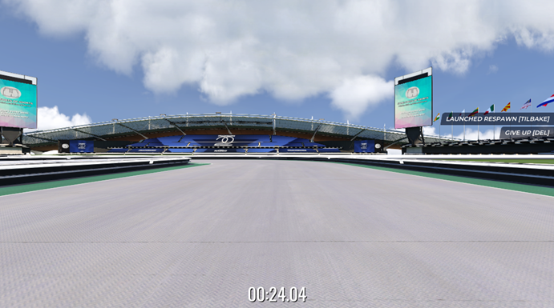

# Instruction Manual for the TMRL Modified Library

The first section, [How to Run](#how-to-run), contains a shortened version of how to setup and run the program features.
However, we’ve experienced many irregularities between different machines and code iterations that we feel it’s necessary to have a more detailed description for how each step operates below, in the section [Instructions & Setup](#instructions--setup).
Then you’ll be familiar with which folders are created, what goes where, and which commands does what. So, it’s all to prepare you for the unknown.

Below that we have a more detailed description of how to create and run your own imitation learning model, under [Extra – Imitation Learning](#extra---imitation-learning).
And then there’s more details about the data analytic programs we’ve used under [Data Analysis Tools](#data-analysis-tools).

We have also added a last section, [Weird Problems and Issues](#problems-and-issues), which underlines some of the weird issues we’ve ran into.
Most of the issues seem to stem from the original library, as it has such a convoluted and fragmented structure. You should look at this section to know what problem may occur, and potential solutions.

### Table of Content
- [How to Run](#how-to-run)
  - [Setup](#setup)
  - [Training](#training)
  - [Run Existing Model](#run-existing-model)
  - [Custom Imitation Learning](#custom-imitation-learning)
- [Instructions and Setup](#instructions--setup)
    - [Required Applications](#1-required-applications)
    - [Library Setup](#2-library-setup)
    - [Training Models](#3-training-models)
    - [Running Existing Models](#4-running-existing-models)
- [Extra - Imitation Learning](#extra---imitation-learning)
    - [Collect own Imitation Data](#collect-imitation-data-yourself)
    - [Running IL Model](#run-the-il-model)
- [Data Analysis Tools](#data-analysis-tools)
- [Weird Problems and Issues](#problems-and-issues)
- [Config Template](#config-template)

Link to the TMRL library [README](/Environment_README.md)

## How to Run
### Setup
The environment:
1. **Create a Ubisoft Account**\
Visit [Ubisoft](https://www.ubisoft.com/) and create an account.

2. **Download Ubisoft Connect**\
Download and install Ubisoft Connect from [here](https://ubisoftconnect.com/).
This is required to play **TrackMania**, which is also available on Steam but still requires a Ubisoft account.

4. **Install Openplanet**\
Download and install the [Openplanet client](https://openplanet.dev/download) for TrackMania.
This is essential for interacting with game data and automation.


Setup the Library:
1. Run `setup.bat`

Enter the environment with the correct map:
1. Go to `C:\Users\[Your_user]\TmrlData\resources` and copy `tmrl-test.map.Gbx`

2. Paste it in this folder `C:\Users\[Your_user]\Documents\Trackmania\Maps\My Maps`

3. You can now access it in the game from the main/starting screen by clicking *CREATE > TRACK EDITOR > EDIT A TRACK > MY LOCAL TRACKS > MY MAPS > TMRL-TEST*, and then the green flag in the bottom left to drive the track.

4. Now it’s important to click "NUM 3" twice to get into the appropriate camera view model (so that you can’t see the car).\
You can also go to settings (which can only be accessed on the start screen), click the "CONTROLS" tab, and then scroll to the bottom to rebind "Camera 3" to another key, like "3".

### Training
Before training a new model, if you want to train from scratch you:
1. Delete this folder --> `C:\Users\[Your_user]\TmrlData`

2. Run `New-Model.bat` which will create a new `TmrlData` folder

3. Find `C:\Users\[Your_user]\TmrlData\config\config.json` and replace the contents with the config at [the end of this document](#config-template).

>[!NOTE]
>But if it’s not that important to train from scratch, then you could just keep the TmrlData folder as is.\
>Just make sure that the `config.json` file contains the same as the config at the end of this document. \
>You can skip to this next step if the TmrlData folder is as you want it.

4. Then you can start training by running:
  - `Train-RL-model.bat` for regular reinforcement learning

  - `Train-Hybrid-model-P1.bat` for hybrid.
  > [!IMPORTANT]
  > This is the P1 hybrid specifically, so make sure you select the right permutation you want

  >[!NOTE]
  >It can take as much as a minute or two before the trainer starts receiving step data.

### Run Existing Model
To run one of the models we trained through our tests:
1. Navigate to the `All Models TmrlData` folder in the project folder. This contains saved `TmrlData` directories.

2. Pick the model folder you want to use.

3. **Delete or rename** your current TmrlData folder (`C:\Users\[Your_user]\TmrlData`)

4. **Copy and paste** the chosen model folder into the `C:\Users\[Your_user]\` path and rename it to *TmrlData*.

Once replaced:
- Start the server and training using the **corresponding hybrid batch file**, e.g.:
  - `Train-Hybrid-model-P1.bat`
  - _Optional_: cross out the `TRAINER` window if you don’t want to train the model

### Custom Imitation Learning
1. Run `Collect-IL-Data.bat` and drive for as many laps as you want (_we did 65-80 laps for the project models_)

2. Run `Train-IL-model.bat`
     - You should save a copy of this `bc_model.pth` output which you rename to something **unique** (e.g. `bc_model_custom.pth`)

3. Run either of these for hybrid training, or IL model test
    - `Train-Hybrid-model.bat` to train the hybrid based on current `bc_model.pth`
    -  `Imitation-Worker.bat` to test the IL model on its own

## Instructions & Setup
Before using the TMRL library, there are a few external applications you need to install and some initial setup steps to follow.
This section covers all of that in detail.

### 1. Required Applications

#### Ubisoft Account & TrackMania
- Create a Ubisoft account via the [official website](https://www.ubisoft.com/).

- Download and install **Ubisoft Connect (Uplay)** from [here](https://ubisoftconnect.com/).

- Use Ubisoft Connect to install **TrackMania**.

> [!NOTE]
> TrackMania is available on Steam as well, but it still requires a Ubisoft account and Ubisoft Connect to run.

#### Openplanet Client
- Download the Openplanet client for TrackMania from [openplanet.dev](https://openplanet.dev/download).

- This is a required tool that enables custom scripting and external interaction with TrackMania during training and evaluation.

### 2. Library Setup
Once the applications above are ready, you can move on to setting up the TMRL library itself.

#### <ins>Run setup.bat </ins>
Start by running the setup.bat script in your project directory.
This script will sequentially execute:
``` bash
python setup.py --install

python setup.py --build

python tmrl/__main__.py --install
```

These commands will create **two important folders**:
> **Egg Folder**\
> **Path:** `C:\Users\[Your_User]\AppData\Local\Programs\Python\Python313\Lib\site-packages\tmrl-0.7.0-py3.13.egg\tmrl`\
> **Contents**: A clone of the tmrl library, including files such as `networking.py`, `__main__.py`, and others.

> [!CAUTION]
> These files must exactly match the versions in your main TMRL project folder.\
> If they are not identical, you will likely run into runtime errors or inconsistencies during execution.

> **Model Data Folder**\
>**Path:** `C:\Users\[Your_user]\TmrlData`\
> **Purpose:**  This folder stores all model-related data, including:
> - Trained weights
> - Reward function settings
> - Checkpoints
> - Configuration files

To use the same map as we used:
1. Go to `C:\Users\[Your_user]\TmrlData\resources` and copy `tmrl-test.map.Gbx`

2. Paste it in this folder `C:\Users\[Your_user]\Documents\Trackmania\Maps\My Maps`

3. You can now access it in the game from the main/starting screen by clicking *CREATE > TRACK EDITOR > EDIT A TRACK > MY LOCAL TRACKS > MY MAPS > TMRL-TEST*, and then the green flag in the bottom left to drive the track.

4. Now it’s important to click "NUM 3" twice to get into the appropriate camera view model (so that you can’t see the car).\
You can also go to settings (which can only be accessed on the start screen), click the "CONTROLS" tab, and then scroll to the bottom to rebind "Camera 3" to another key, like "3".




### 3. Training Models
All model weights, logs, and configuration are stored in the TmrlData folder located at:

```
C:\Users\[Your_user]\TmrlData
```

If you want to **start training from scratch**, you need to:
1. **Delete** the existing TmrlData folder.

2. Run `New-Model.bat` to generate a clean one.

3. Open the config file at `TmrlData/config/config.json`, and **manually update its contents** using the provided config template ([see bottom of this document](#config-template))
>[!IMPORTANT]
> Make sure the `"RUN_NAME"` field is set to something **unique**

#### <ins> Pure Reinforcement Learning (RL) Models </ins>
To train a model using pure reinforcement learning run `Train-RL-model.bat`

The batch file will
- Start the server `python tmrl/__main__.py --server` on port 55555
- Once the server is up, it automatically launches:
    - A worker: `python tmrl/__main__.py --rl-worker`
    - A trainer: `python tmrl/__main__.py --trainer`

These components work together to generate rollouts and update the RL model in real-time.

#### <ins>Hybrid Models (RL + Imitation Learning)</ins>
Hybrid models combine reinforcement learning with imitation learning, and each implemented variant has its own batch file.

To train a hybrid model:
-  Run the batch file corresponding to the model variant, for example:
    - `Train-Hybrid-model-P1.bat`

This script behaves like the RL trainer but starts with a few key steps:
- Deletes any existing `bc_model.pth` file.

- Copies the desired IL model (f.ex. P1) and renames it to `bc_model.pth`

- And then it runs `--worker` instead of `--rl-worker`
>[!NOTE]
  >It can take as much as a minute or two before the trainer starts receiving step data.

## 4. Running Existing Models
If you want to **resume training or continue from a previously trained model:**
1. Navigate to the `All Models TmrlData` folder — this contains saved `TmrlData` directories from earlier test runs.

2. Pick the model folder you want to use.

3. **Delete or rename** your current *TmrlData* folder (This one: `C:\Users\[Your_user]\TmrlData`)

4. **Copy and paste** the chosen model folder into the same location and rename it to *TmrlData*.

Once replaced:

Start the server and training using the **corresponding hybrid batch file**, e.g.:
- `Train-Hybrid-model-P1.bat`
> [!NOTE]
> Even though the batch script will run regardless of which model you choose, using the correct one ensures you're loading both the correct **RL state** (from the TmrlData folder) and the matching **IL model** (`bc_model.pth` for the same permutation in the project folder).

#### <ins>Running Without Further Training</ins>
If you simply want to **run the model without continuing training**:
- Launch the hybrid batch script as usual.

- Once the trainer window appears, **just close it**.

- The server and worker will continue to run the existing model in inference mode.


## Extra - Imitation Learning
If you want to train a pure imitation learning model or create a hybrid model that combines your custom IL with reinforcement learning, this section explains how to collect driving data, train the model, and run it with the hybrid and standalone.

### Collect Imitation Data Yourself
To start, you need to record your own driving data from TrackMania.
This data will be used to train the IL model.

#### 1. **Run the following batch file** -> `Collect-IL-Data.bat`
This runs:
- `python tmrl/__main__.py --server`
- `python tmrl/__main__.py --imitation`

This will:
- Collect LiDAR readings, velocity data, and your manual driving inputs.

- Save each step to a file called “demonstration_data.csv”
> [!NOTE]
> 50000 lines/steps is approximately 60-70 laps

#### 2. **Run the following batch file to train the IL Model**: `Train-IL-model.bat`
This runs `csvModifier.py` which filters `demonstration_data.csv` and gives you `demonstration_filtered.csv`\
(removes the idle steps. Otherwise the model won’t be able to start).

Then runs `IL-nn.py` to create `bc_model.pth`
  o	Although, the current implementation trains the 3-layer architecture. So you'll have to change it in the code if you want a different structure

> [!TIP]
> You should make a copy of `bc_model.pth` which you call something unique like `bc_model_custom.pth`, this way when `bc_model.pth` is overwritten from running `Train-Hybrid-model-P3.bat` (or something), you still have the model saved.

### Run the IL Model
At this point, your imitation learning model is ready to use.

#### <ins>Option 1: Train Hybrid Model Using IL</ins>
Run: “Train-Hybrid-model.bat”
- This will begin training using the `bc_model.pth` file.
> [!TIP]
> If you’ve trained your own IL model, **back it up and rename** it to avoid it being overwritten by another batch file (e.g., `bc_model_custom.pth`).

#### <ins>Option 2: Run IL-Only Mode</ins>
To run the IL on its own, similar to how we tested the IL models with the 30-laps test, run `Imitation-Worker.bat`.
- This will use the current `bc_model.pth` file

- Starts the server `python tmrl/__main__.py --server`

- And then `python tmrl/__main__.py --imitation-worker`

This will produce `IL-rew.json` which saves the reward at the end of each lap and can be used in `IL_model_analysis.py` to map how far the IL model got through multiple runs.

## Data Analysis Tools
We've created several graphing tools to visualize and compare model performance.
These scripts were used for generating report figures and internal analysis:
- `Box_plot_results.py` \
→ Generates box plots to compare different model groups.

- `Display-ComparativeData.py`\
→ Plots side-by-side comparisons of various model runs.

- `Display-GoalData.py`\
→ Plots a single model’s performance over time.

- `IL_model_analysis.py`\
→ (*Tool-specific functionality; likely supports IL evaluation and visualization.*)

### Time Alignment for 24-Hour Analysis
Our analytics scripts are designed to isolate performance data across 24-hour periods, using timestamps from `goal_timestamps.json`.
> [!IMPORTANT]
> To make this work:\
> You must provide the **correct training start time** (e.g., 2025-05-01 18:07).

## Problems and Issues
There are issues with the library which we haven’t been able to assess.
They mostly stem from the fragmented nature of the RL deployment which was already present in the TMRL library.

### Problem 1
Only 2 out of 4 computers on the project team can run agents properly.
This does not seem to correlate with versions of Windows (Windows 10 and 11), python, or libraries as changing to what the working PCs have been using have made no difference.

Hardware also doesn’t seem to be the problem either as we’ve tried different GPUs (AMD and Nvidia) and CPUs (AMD and Intel), but these seem to make no feasible difference.

For this problem the agent can be loaded and such, but the neural network behind the IL and RL isn’t working as intended, their act values are much lower than what they should output.
Subsequently the agent drives forward for only 1 step and then stands still until restart.

> [!IMPORTANT]
> Any value lower than ~0.6 returns no output for throttle and reverse.

This issue has plagued the team for the entire project period, but no changes seem to make a difference.
We believe this issue has something to do with the complexity of the original library since it creates files in two other locations (*that we know of*) which also must be kept up to date as we work on the project.

### Problem 2
If any changes are made in the library, then these changes need to be made to the corresponding files in the folder (this folder is downloaded on setup)
```
C:\Users\[Your_user]\AppData\Local\Programs\Python\Python313\Lib\site-packages\tmrl-0.7.0-py3.13.egg\tmrl
```

**Solution**:\
Just copy+paste the `networking.py` and `__main__.py` files over to the `tmrl-0.7.0-py3.13.egg\tmrl` library and overwrite their respective files.

### Problem 3
When attempting to change the IL model_path in the code from `bc_model.pth` to something else, runtime errors occur.
Even if all different codes at different locations has it set to the same name, it still doesn’t work.
But it’s not the case for everyone, one project member which had issues with the RL deployment was able to avoid this runtime error when changing names.

We believe this might be a problem with inference, but we struggle to understand where/how exactly.

### Problem 4
Hardware can impact how some libraries work. The most notable being PyTorch which struggles to run the Trainer if you are on a cuda system. So if the trainer gets this error:
```
RuntimeError: Attempting to deserialize object on a CUDA device but torch.cuda.is_available() is False. If you are running on a CPU-only machine, please use torch.load with map_location=torch.device('cpu') to map your storages to the CPU.
```
**Solution**: You have get a version of pytorch that supports the appropriate cuda platform.


## Config Template
```json
{
  "RUN_NAME": "SAC_4_lidar_Examinator",
  "RESET_TRAINING": false,
  "BUFFERS_MAXLEN": 500000,
  "RW_MAX_SAMPLES_PER_EPISODE": 1000,
  "CUDA_TRAINING": true,
  "CUDA_INFERENCE": false,
  "VIRTUAL_GAMEPAD": true,
  "DCAC": false,
  "LOCALHOST_WORKER": true,
  "LOCALHOST_TRAINER": true,
  "PUBLIC_IP_SERVER": "0.0.0.0",
  "PASSWORD": "==>TMRL@UseASecurePasswordHere!<==",
  "TLS": false,
  "TLS_HOSTNAME": "default",
  "TLS_CREDENTIALS_DIRECTORY": "",
  "NB_WORKERS": -1,
  "WANDB_PROJECT": "ImitationReinforcment-TrainingData",
  "WANDB_ENTITY": "sofiehk-oslomet",
  "WANDB_KEY": "78b365b6e95165722322a2d64629035428c95098",
  "PORT": 55555,
  "LOCAL_PORT_SERVER": 55556,
  "LOCAL_PORT_TRAINER": 55557,
  "LOCAL_PORT_WORKER": 55558,
  "BUFFER_SIZE": 536870912,
  "HEADER_SIZE": 12,
  "SOCKET_TIMEOUT_CONNECT_TRAINER": 300.0,
  "SOCKET_TIMEOUT_ACCEPT_TRAINER": 300.0,
  "SOCKET_TIMEOUT_CONNECT_ROLLOUT": 300.0,
  "SOCKET_TIMEOUT_ACCEPT_ROLLOUT": 300.0,
  "SOCKET_TIMEOUT_COMMUNICATE": 30.0,
  "SELECT_TIMEOUT_OUTBOUND": 30.0,
  "ACK_TIMEOUT_WORKER_TO_SERVER": 300.0,
  "ACK_TIMEOUT_TRAINER_TO_SERVER": 300.0,
  "ACK_TIMEOUT_SERVER_TO_WORKER": 300.0,
  "ACK_TIMEOUT_SERVER_TO_TRAINER": 7200.0,
  "RECV_TIMEOUT_TRAINER_FROM_SERVER": 7200.0,
  "RECV_TIMEOUT_WORKER_FROM_SERVER": 600.0,
  "WAIT_BEFORE_RECONNECTION": 10.0,
  "LOOP_SLEEP_TIME": 1.0,
  "MAX_EPOCHS": 1000,
  "ROUNDS_PER_EPOCH": 100,
  "TRAINING_STEPS_PER_ROUND": 200,
  "MAX_TRAINING_STEPS_PER_ENVIRONMENT_STEP": 4.0,
  "ENVIRONMENT_STEPS_BEFORE_TRAINING": 1000,
  "UPDATE_MODEL_INTERVAL": 200,
  "UPDATE_BUFFER_INTERVAL": 200,
  "SAVE_MODEL_EVERY": 0,
  "MEMORY_SIZE": 1000000,
  "BATCH_SIZE": 256,
  "ALG": {
    "ALGORITHM": "SAC",
    "LEARN_ENTROPY_COEF":false,
    "LR_ACTOR":0.00001,
    "LR_CRITIC":0.00005,
    "LR_ENTROPY":0.0003,
    "GAMMA":0.995,
    "POLYAK":0.995,
    "TARGET_ENTROPY":-0.5,
    "ALPHA":0.01,
    "REDQ_N":10,
    "REDQ_M":2,
    "REDQ_Q_UPDATES_PER_POLICY_UPDATE":20,
    "OPTIMIZER_ACTOR": "adam",
    "OPTIMIZER_CRITIC": "adam",
    "BETAS_ACTOR": [0.997, 0.997],
    "BETAS_CRITIC": [0.997, 0.997],
    "L2_ACTOR": 0.0,
    "L2_CRITIC": 0.0
  },
  "ENV": {
    "RTGYM_INTERFACE": "TM20LIDAR",
    "WINDOW_WIDTH": 958,
    "WINDOW_HEIGHT": 488,
    "IMG_WIDTH": 64,
    "IMG_HEIGHT": 64,
    "IMG_GRAYSCALE": true,
    "SLEEP_TIME_AT_RESET": 1.5,
    "IMG_HIST_LEN": 4,
    "RTGYM_CONFIG": {
      "time_step_duration": 0.05,
      "start_obs_capture": 0.04,
      "time_step_timeout_factor": 1.0,
      "act_buf_len": 2,
      "benchmark": false,
      "wait_on_done": true,
      "ep_max_length": 1000,
      "interface_kwargs": {"save_replays": false}
    },
    "REWARD_CONFIG": {
        "END_OF_TRACK": 100.0,
        "CONSTANT_PENALTY": 0.0,
        "CHECK_FORWARD": 500,
        "CHECK_BACKWARD": 10,
        "FAILURE_COUNTDOWN": 10,
        "MIN_STEPS": 70,
        "MAX_STRAY": 100.0
    }
  },
  "__VERSION__": "0.6.0"
}

```
